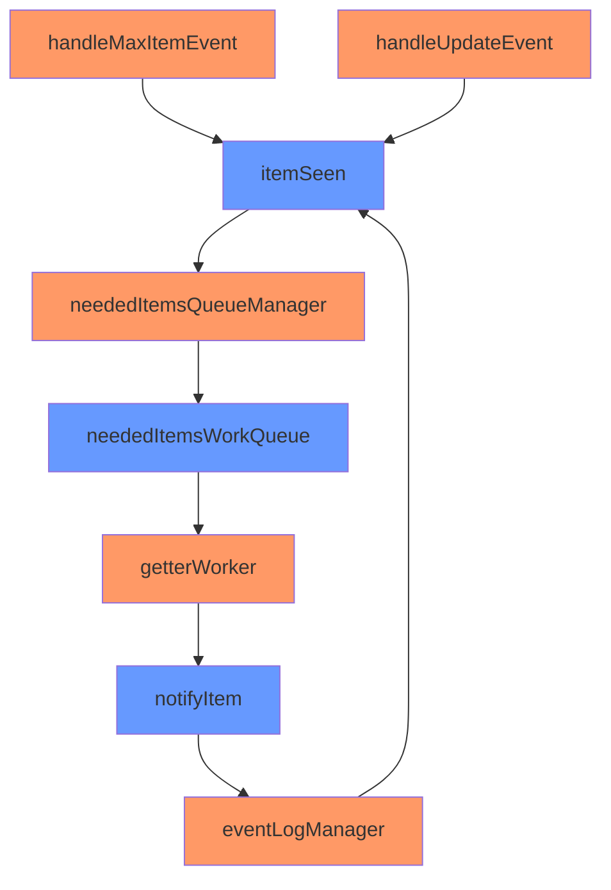

```mermaid
graph TD;
    classDef func fill:#f96
    classDef chan fill:#69f

    handleMaxItemEvent:::func
    handleUpdateEvent:::func
    neededItemsQueueManager:::func
    getterWorker:::func
    eventLogManager:::func
    
    itemSeen:::chan
    neededItemsWorkQueue:::chan
    notifyItem:::chan

    handleMaxItemEvent --> itemSeen
    handleUpdateEvent --> itemSeen
    itemSeen --> neededItemsQueueManager
    neededItemsQueueManager --> neededItemsWorkQueue
    neededItemsWorkQueue --> getterWorker
    getterWorker --> notifyItem
    notifyItem --> eventLogManager
    eventLogManager --> itemSeen
```

Bugs:
1. The maxitem listener isn't working. Hopefully this is redundant because the updates feed.
